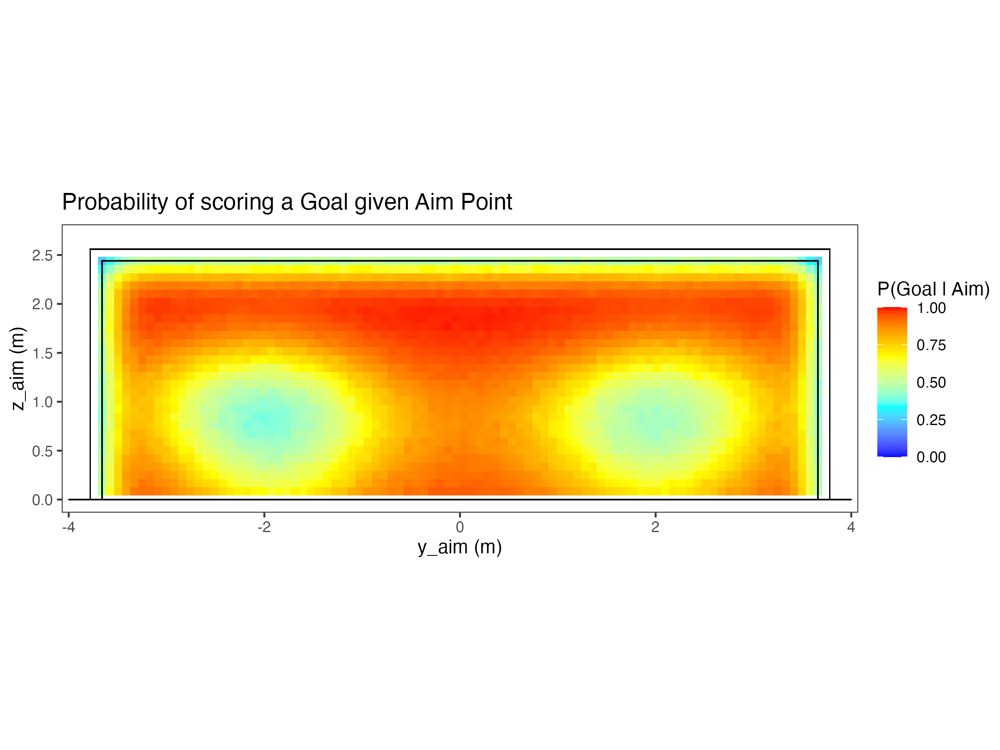

# bayesian-penalties
Bayesian modeling of soccer penalty shot locations

## Data:
- `penalties_scraped.csv`: Contains 1361 penalties scraped from 3464 games from [StatsBomb](https://github.com/statsbomb/open-data) dataset
- `penalties_scraped_corrected.csv`: Cleaned dataset:
  -  Goals outside the standard goal size mapped into the goal
  -  Shots classified as *Post* mapped to the actual goal frame
  -  *Off T* also mapped using the same scale

 ## Models:
- `multinomial_model.qmd`: Multinomial model with three targets (`Goal`, `Saved`, `Off T`)
- `animation.qmd`: Create a .gif animation to display draws from the posterior (using the multinomial model)
- `binary_model.qmd`: Binary model with three targets (`Goal`, `Saved`) conditioned on the goal frame
  - Includes risk simulations of shooting off target 
- `risk_model.qmd`: Fits a noise model to estimate population level variance for shot locations (horizontal and vertical SD and correlation between them)
  - Used to run simulations to include the risk of shooting off target
  
## Results
Posterior distribution of scoring a goal given an aim point of the goal: $P(\text{Goal}|\text{Aim})$

  

