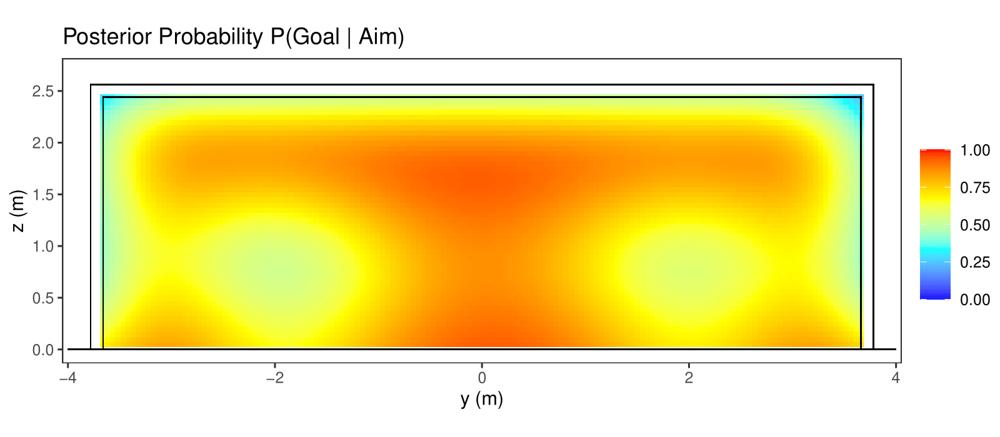

# bayesian-penalties
**Bayesian modeling of soccer penalty shot locations and risk-adjusted aiming strategies.**

This project uses Bayesian hierarchical models to analyze penalty kicks from two perspectives: 
1. **The Probability of Scoring:** Estimating $P(\text{Goal} | \text{Location})$ using a Generalized Additive Model (GAM) to map the "unsavable" zones of the goal.
2. **The Shooter's Precision:** Estimating player-specific aiming errors ($\sigma_y, \sigma_z$) using a distributional location-scale model.

By convolving these two models, we calculate the **Risk-Adjusted Probability**, $P(\text{Goal} | \text{Aim})$, which identifies optimal aiming points that balance the reward of high-probability zones with the risk of missing the target.

## Data:
- `penalties_scraped.csv`: Contains 1361 penalties scraped from 3464 games from [StatsBomb](https://github.com/statsbomb/open-data) dataset
- `penalties_scraped_corrected.csv`: Cleaned dataset:
  -  Goals outside the standard goal size mapped into the goal
  -  Shots classified as *Post* mapped to the actual goal frame
  -  *Off T* also mapped using the same scale

 ## Models:
- `bayesian-penalties.qmd`: Main script that fits binary model, precision model, and produces all figures
- `src/config.R`: Configuration file with goal dimensions, grid size and seed
- `src/soccer_functions.R`: Functions for probability grid generation, numerical integration of risk probabilities, and custom ggplot goal frames
  
## Results
Posterior distribution of scoring a goal given an aim point of the goal: $P(\text{Goal}|\text{Aim})$
<figure style="margin-top: -10px;" align="center">
  
</figure>

